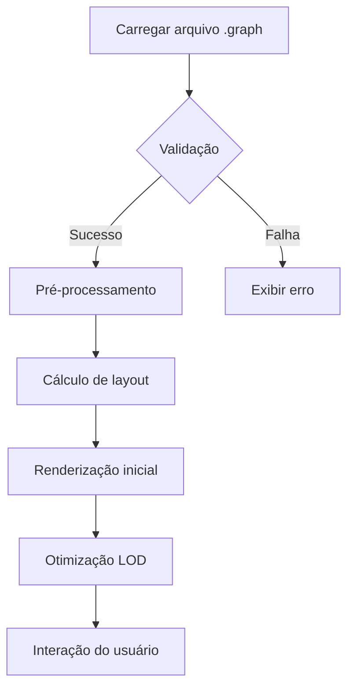

# Documento de Requisitos - Sistema Cartógrafo da Internet

## 1. Introdução
Este documento especifica os requisitos funcionais e não funcionais para o **Sistema Cartógrafo da Internet**, composto por dois módulos principais:  
- **Explorador de Rede**: Coleta e processa dados de topologia de rede  
- **Cartógrafo da Internet**: Visualização interativa de grafos de rede  

**Objetivo Principal**: Permitir mapeamento, análise e visualização de topologias de rede a partir de dados de `traceroute`.

## 2. Visão Geral do Sistema
| Módulo | Função | Entrada | Saída |
|--------|--------|---------|-------|
| **Explorador de Rede** | Coleta e processa dados de rede | Alvos (IPs/FQDNs), protocolos | Arquivo `.graph` |
| **Cartógrafo da Internet** | Visualização interativa | Arquivo `.graph` | Visualização gráfica, relatórios |

## 3. Requisitos Funcionais

### 3.1 Explorador de Rede
| ID | Requisito | Prioridade | Critério de Aceite |
|----|-----------|------------|--------------------|
| ER01 | Executar `traceroute` com protocolos UDP/ICMP/TCP | Alta | Suportar ≥10 alvos simultâneos |
| ER02 | Identificar tipos de nós (explorador, alvo, hop, fantasma) | Alta | Classificação correta em 99% dos casos |
| ER03 | Coletar latências e calcular médias para conexões | Alta | Armazenar ≥3 amostras por conexão |
| ER04 | Consultar API Geo-IP (ip-api.com) para dados de localização | Média | Cache de resultados para IPs repetidos |
| ER05 | Migrar arquivos `.graph` de versões anteriores | Alta | Conversão automática v0.5+ para v0.6+ |
| ER06 | Gerar relatório de execução com estatísticas | Média | Incluir novos nós, arestas, latências médias |
| ER07 | Validar integridade do arquivo `.graph` | Alta | Detectar corrupção em 100% dos casos |

### 3.2 Cartógrafo da Internet
| ID | Requisito | Prioridade | Critério de Aceite |
|----|-----------|------------|--------------------|
| CI01 | Carregar e renderizar arquivos `.graph` v0.6+ | Alta | Carregar 5MB em <3s |
| CI02 | Implementar zoom hierárquico com LOD dinâmico | Alta | Ocultar nós fantasmas em zoom <0.3x |
| CI03 | Renderizar territórios de ISP como polígonos | Alta | Visíveis em zoom <0.8x |
| CI04 | Exibir painel de informações geográficas hierárquicas | Alta | `district > regionName > city > coordinates` |
| CI05 | Seleção de elementos com exibição de detalhes | Alta | Tooltips com IP, FQDN, ISP, latências |
| CI06 | Exportar visualização para PNG/PDF | Média | Resolução mínima 1920x1080 |
| CI07 | Reorganização automática por provedor (ISP) | Média | Tempo de processamento <15s para 500 nós |
| CI08 | Implementar física de rede ajustável | Alta | Estabilização em ≤90s para 1000 nós |

## 4. Requisitos Não Funcionais

### 4.1 Desempenho
| ID | Requisito | Métrica |
|----|-----------|---------|
| NF01 | Tempo de resposta do traceroute | ≤180s por alvo |
| NF02 | Estabilização da visualização | ≤90s para 1000 nós |
| NF03 | Taxa de quadros mínima | 30fps em zoom 1x (500 nós) |
| NF04 | Consumo de memória | ≤2MB/1000 nós |

### 4.2 Usabilidade
| ID | Requisito | Validação |
|----|-----------|-----------|
| NF05 | Feedback de carregamento | Barra de progresso + percentual |
| NF06 | Compatibilidade com navegadores | Chrome, Firefox, Edge (últimas 2 versões) |
| NF07 | Interface responsiva | Funcional em resoluções ≥1280x720 |

### 4.3 Dados
| ID | Requisito | Especificação |
|----|-----------|---------------|
| NF08 | Formato arquivo `.graph` | JSON schema v0.6+ |
| NF09 | Estrutura de nós | `{id, label, group, geo_info}` |
| NF10 | Estrutura de arestas | `{from, to, latencies[]}` |

## 5. Regras de Negócio

### 5.1 Priorização de Dados Geográficos
```javascript
function getGeoLabel(geo) {
  return geo.district || geo.regionName || geo.city || 
         (geo.lat && geo.lon ? `${geo.lat}, ${geo.lon}` : 'N/A');
}
```

### 5.2 Tratamento de Exceções
| Caso | Ação |
|------|------|
| Falha no carregamento | Manter último arquivo válido + toast de erro |
| Dados geográficos incompletos | Exibir apenas IP/FQDN, ocultar seção geográfica |
| Timeouts consecutivos | Criar nós fantasmas com identificação visual |

### 5.3 Parâmetros de Física
| Parâmetro | Valor | Efeito |
|-----------|-------|--------|
| Iterações | 5000 | Pós-carregamento |
| Damping | 0.5 | Prevenir oscilações |
| Gravidade | -25000 | Manter coesão espacial |

## 6. Especificações Técnicas

### 6.1 Estrutura de Dados (`.graph`)
```typescript
interface Node {
  id: string;
  label: string;
  group: 'explorer' | 'target' | 'hop' | 'phantom';
  geo_info?: {
    country: string;
    regionName: string;
    city: string;
    isp: string;
    lat: number;
    lon: number;
  };
}

interface Edge {
  from: string;
  to: string;
  latencies: number[];
  avg_latency?: number;
}
```

### 6.2 Fluxo de Processamento


## 7. Interface do Usuário

### 7.1 Layout Principal
```
+-------------------------------------------+
| [Arquivo: v0.6 (2024-01-01)]             |
+------------------------------+------------+
|                              |   LEGENDA  |
|          VISUALIZAÇÃO        |------------|
|                              |  INFO NÓ   |
+------------------------------+------------+
```

### 7.2 Elementos Visuais
| Tipo de Nó | Ícone | Cor |
|------------|-------|-----|
| Explorador | ⚡ | Azul |
| Alvo | 🎯 | Vermelho |
| Hop | ● | Verde |
| Fantasma | ◌ | Cinza |

## 8. Casos de Uso

### 8.1 Mapeamento Completo de Rede
1. Usuário executa Explorador com alvos  
2. Sistema coleta dados via traceroute  
3. Armazena resultados em `.graph`  
4. Usuário abre arquivo no Cartógrafo  
5. Sistema renderiza topologia interativa  

### 8.2 Análise de Desempenho
1. Usuário seleciona conexão no Cartógrafo  
2. Sistema exibe gráfico de latência histórica  
3. Identifica gargalos (>150ms latency)  
4. Exporta relatório em PDF  

## 9. Planejamento de Versões

| Versão | Funcionalidades | Entrega |
|--------|----------------|---------|
| v0.6.10 | Simplificação da verificação de versão | Imediata |
| v0.7.0 | Histórico de conexões, exportação PNG | 30 dias |
| v0.8.0 | Análise de gargalos, multi-threading | 60 dias |
| v1.0 | Banco de dados integrado | 90 dias |

## 10. Glossário

| Termo | Definição |
|-------|-----------|
| LOD | Nível de Detalhe baseado em zoom |
| ISP Cluster | Agrupamento de nós por provedor |
| Hop | Nó intermediário em rota de rede |
| FQDN | Nome de domínio totalmente qualificado |
| Nó Fantasma | Hop não-respondente inferido por timeouts |
